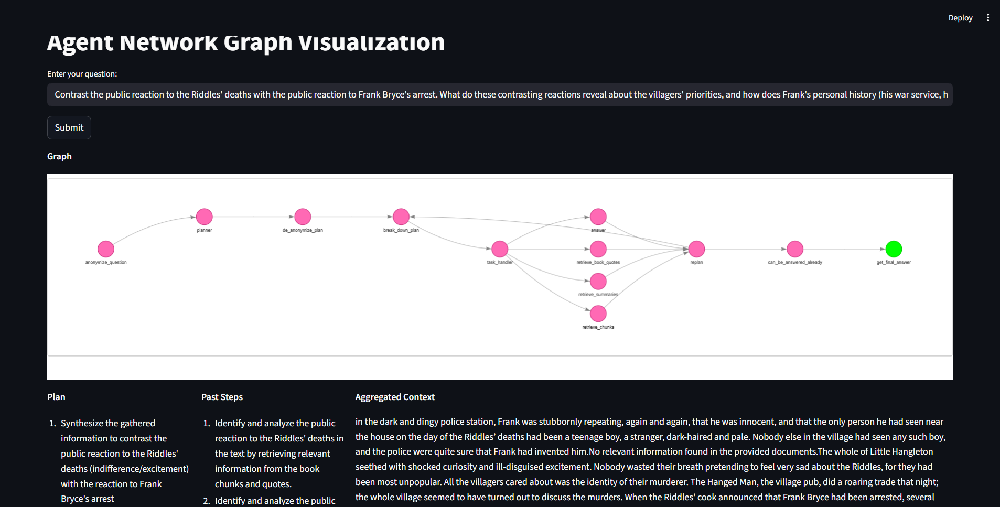

# 🤖 SOPHISTICATED-AGENT

**An Intelligent, Multi-Step AI Agent for Advanced Question Answering and Document Analysis**

A sophisticated LLM-powered agent that processes complex user queries through a state-driven workflow, retrieves relevant information from multiple vector stores, and generates contextual, accurate answers using Retrieval-Augmented Generation (RAG).

---

## 📋 Table of Contents

- [What is This?](#what-is-this)
- [What Problem Does It Solve?](#what-problem-does-it-solve)
- [How Can It Help?](#how-can-it-help)
- [Architecture & Structure](#architecture--structure)
- [Installation & Setup](#installation--setup)
- [How to Use](#how-to-use)
- [Assets](#assets)
- [Configuration](#configuration)
- [Development & Testing](#development--testing)
- [Technologies Used](#technologies-used)
- [Contributing](#contributing)
- [License](#license)

---

## What is This?

**SOPHISTICATED-AGENT** is an advanced AI-powered question-answering system designed to intelligently process user queries through a multi-stage workflow. It combines:

- **State-based Orchestration**: A graph-based workflow that guides queries through multiple processing stages
- **Retrieval-Augmented Generation (RAG)**: Retrieves relevant context from multiple vector stores before generating answers
- **Natural Language Understanding**: Anonymizes queries, plans responses, and breaks down complex tasks into manageable steps
- **Multi-source Data Retrieval**: Searches across three distinct vector stores for comprehensive context

The agent is built on **LangChain** and **LangGraph** for orchestration, **Streamlit** for the user interface, and **MLflow** for experiment tracking and reproducibility.

---

## What Problem Does It Solve?

### Challenges Addressed:

1. **Context Limitation**: Traditional LLMs have limited context windows. This agent retrieves relevant information from large document collections before generating answers.

2. **Accuracy & Hallucination**: By grounding responses in retrieved documents, the agent reduces AI hallucinations and provides factual, source-based answers.

3. **Complex Query Processing**: Users often ask multi-part questions that require breaking down into sub-tasks. This agent intelligently decomposes and handles them.

4. **Information Organization**: The system maintains anonymized processing states, making it suitable for privacy-sensitive applications.

5. **Reproducibility**: MLflow integration ensures every query execution is logged, tracked, and reproducible for auditing and improvement.

---

## How Can It Help?

### Use Cases:

✅ **Document-based Q&A Systems**: Answer questions about books, research papers, or large document collections  
✅ **Knowledge Base Search**: Intelligent retrieval from chunked content, summaries, and specific quotes  
✅ **Complex Query Processing**: Handle multi-part questions requiring task decomposition  
✅ **Enterprise Knowledge Management**: Ground responses in organizational documents with privacy considerations  
✅ **Research Assistance**: Retrieve and synthesize information from academic sources  
✅ **Interactive Learning**: Provide contextual answers while maintaining transparency (MLflow tracking)

### Key Benefits:

- 🎯 **Accurate Answers**: RAG ensures responses are grounded in actual documents
- 🔄 **Intelligent Workflow**: Multi-stage processing pipeline handles complexity
- 📊 **Full Traceability**: MLflow tracking enables experimentation and debugging
- 🛡️ **Privacy-Aware**: Anonymization layer for sensitive query processing
- 🚀 **Easy to Use**: Simple Streamlit interface for end-users
- 🔧 **Extensible**: Modular design allows adding new retrieval sources or processing steps

---

## Architecture & Structure

### Workflow Pipeline

```
User Query
    ↓
[1] anonymize_question    → Remove personally identifiable information
    ↓
[2] planner              → Create high-level plan for response
    ↓
[3] de_anonymize_plan    → Restore context while maintaining plan structure
    ↓
[4] break_down_plan      → Decompose into actionable tasks
    ↓
[5] task_handler         → Execute each task with appropriate tools
    ↓
[6] Retrieval Steps      → Search across multiple vector stores
    ├── chunks_vector_store (General chunked content)
    ├── chapter_summaries_vector_store (Summarized chapters)
    └── book_quotes_vectorstore (Specific quotes)
    ↓
[7] answer               → Generate final contextual response
    ↓
Final Answer (logged to MLflow)
```

### Data Architecture

**Three-Tier Vector Store System:**

| Vector Store                     | Purpose                      | Use Case                |
| -------------------------------- | ---------------------------- | ----------------------- |
| `chunks_vector_store`            | General segmented content    | Broad context retrieval |
| `chapter_summaries_vector_store` | High-level chapter summaries | Quick overviews         |
| `book_quotes_vectorstore`        | Specific, memorable passages | Exact quote retrieval   |

### Technology Stack

```
┌─────────────────────────────────────┐
│     Frontend & Interaction           │
│  Streamlit (Web UI)                  │
└─────────────────────────────────────┘
           ↓
┌─────────────────────────────────────┐
│     Orchestration & State Management │
│  LangChain + LangGraph (StateGraph)  │
└─────────────────────────────────────┘
           ↓
┌─────────────────────────────────────┐
│     Data Processing & Retrieval      │
│  Vector Stores + RAG Pattern         │
└─────────────────────────────────────┘
           ↓
┌─────────────────────────────────────┐
│     PDF Processing                   │
│  PyPDF2 + pdfplumber                 │
└─────────────────────────────────────┘
           ↓
┌─────────────────────────────────────┐
│     Experiment Tracking              │
│  MLflow (Metrics & Artifacts)        │
└─────────────────────────────────────┘
```

---

## Installation & Setup

### Prerequisites

- Python 3.8 or higher
- pip (Python package manager)
- MLflow server (optional but recommended)

### Step 1: Clone the Repository

```bash
git clone https://github.com/maitimeraki/SOPHISTICATED-AGENT.git
cd SOPHISTICATED-AGENT
```

### Step 2: Create a Virtual Environment

```bash
python -m venv venv
source venv/bin/activate  # On Windows: venv\Scripts\activate
```

### Step 3: Install Dependencies

```bash
pip install -r requirements.txt
```

### Step 4: Set Up Environment Variables

Create a `.env` file in the project root with the following variables:

```env
# LLM Configuration
OPENAI_API_KEY=your_openai_api_key_here

# MLflow Configuration
MLFLOW_TRACKING_URI=http://localhost:5000

# Optional: Other configurations
LOG_LEVEL=INFO
```

### Step 5: (Optional) Start MLflow Server

```bash
mlflow ui
```

This starts MLflow at `http://localhost:5000` for tracking and visualization.

---

## How to Use

### Running the Application

1. **Start the Streamlit App:**

```bash
streamlit run sophisticated_agent.py
```

The app will open in your browser at `http://localhost:8501`

2. **Using the Interface:**
   - Enter your question in the text input field
   - Click "Submit" or press Enter
   - The agent processes your query through the entire pipeline
   - View the final answer with full context from retrieved documents
   - Check MLflow dashboard for execution traces and metrics

### Example Queries

```
"What are the main themes in Chapter 5?"
"Compare the different approaches mentioned in the document."
"Find specific quotes related to innovation."
"What are the prerequisites for the advanced topics?"
```

### Viewing Execution Details

1. **In the App**: Responses include source information and retrieval details
2. **In MLflow**: Navigate to `http://localhost:5000` to view:
   - Execution DAG (workflow graph)
   - Token usage metrics
   - Query timing information
   - Retrieved context sources

---

## Assets



---

### Testing Individual Functions

```bash
# Create a temporary script or use Python REPL
python
>>> from functions_for_pipeline import anonymize_question
>>> result = anonymize_question("My name is John, ask about page 50")
>>> print(result)
```

### Debug Mode

Set environment variable for verbose logging:

```bash
export LOG_LEVEL=DEBUG
streamlit run sophisticated_agent.py
```

### MLflow Integration

Every execution automatically logs:

- 📊 Query metadata and parameters
- ⏱️ Execution time per step
- 🔤 Token usage (input/output)
- 📈 Network graph visualization
- 📝 Full execution trace

---

## Technologies Used

| Component               | Technology           | Version |
| ----------------------- | -------------------- | ------- |
| **Orchestration**       | LangChain, LangGraph | Latest  |
| **LLM**                 | OpenAI GPT-4         | Latest  |
| **UI**                  | Streamlit            | ≥1.28   |
| **Embeddings**          | OpenAI Embeddings    | Latest  |
| **Vector Store**        | FAISS / Chroma       | Latest  |
| **PDF Processing**      | PyPDF2, pdfplumber   | Latest  |
| **Experiment Tracking** | MLflow               | ≥2.0    |
| **Language**            | Python               | 3.8+    |

---

## Workflow Details

### State Graph Nodes

| Node                      | Function                  | Output                  |
| ------------------------- | ------------------------- | ----------------------- |
| `anonymize_question`      | Removes PII from query    | Anonymized query string |
| `planner`                 | Creates response strategy | High-level plan         |
| `de_anonymize_plan`       | Restores context          | Enriched plan           |
| `break_down_plan`         | Decomposes to tasks       | Task list               |
| `task_handler`            | Executes tasks            | Task results            |
| `retrieve_from_chunks`    | Searches chunk store      | Relevant passages       |
| `retrieve_from_summaries` | Searches summary store    | Chapter summaries       |
| `retrieve_from_quotes`    | Searches quote store      | Relevant quotes         |
| `answer`                  | Generates final response  | User-facing answer      |

---

## Common Issues & Troubleshooting

### Issue: MLflow Server Not Running

**Solution**: Start MLflow with `mlflow ui` and verify it's accessible at `http://localhost:5000`

### Issue: Vector Stores Not Found

**Solution**: Run `python vector_stores/create_vector_stores.py` to initialize vector stores from documents

### Issue: API Key Errors

**Solution**: Verify your `.env` file contains valid `OPENAI_API_KEY`

### Issue: Slow Retrieval

**Solution**: Check vector store indices are properly built; consider reducing chunk size in `settings.py`

---

## Future Enhancements

- [ ] Support for multiple document formats (CSV, JSON, etc.)
- [ ] Custom embedding model options
- [ ] Streaming responses for long answers
- [ ] Advanced filtering and metadata-based retrieval
- [ ] User feedback loop for continuous improvement
- [ ] Multi-language support
- [ ] Caching for frequently asked questions

---

## Contributing

1. Fork the repository
2. Create a feature branch (`git checkout -b feature/amazing-feature`)
3. Commit changes (`git commit -m 'Add amazing feature'`)
4. Push to branch (`git push origin feature/amazing-feature`)
5. Open a Pull Request

Please refer to [CLAUDE.md](CLAUDE.md) for development guidelines.

---

## License

This project is licensed under the MIT License - see the LICENSE file for details.

---

## Support & Questions

- 📧 **Email**: [Your Email]
- 🐛 **Issues**: [GitHub Issues](https://github.com/maitimeraki/SOPHISTICATED-AGENT/issues)
- 💬 **Discussions**: [GitHub Discussions](https://github.com/maitimeraki/SOPHISTICATED-AGENT/discussions)

---

## Acknowledgments

- LangChain & LangGraph teams for the orchestration framework
- OpenAI for GPT and embedding models
- Streamlit for the interactive UI framework
- MLflow for experiment tracking

---

**Built with ❤️ by [Maitimeraki](https://github.com/maitimeraki)**

Last Updated: 2026-07-06
